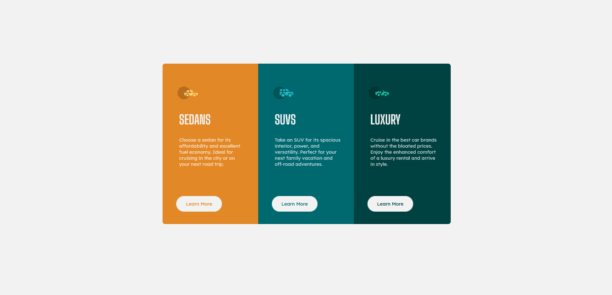

# frontendmentor-cars

This is a solution to the [3-column preview card component challenge on Frontend Mentor](https://www.frontendmentor.io/challenges/3column-preview-card-component-pH92eAR2-/hub/3column-preview-card-component-i_HucBQ6s). Frontend Mentor challenges help you improve your coding skills by building realistic projects. 

## Table of contents

- [Overview](#overview)
  - [The challenge](#the-challenge)
  - [Screenshot](#screenshot)
  - [Links](#links)
- [My process](#my-process)
  - [Built with](#built-with)
  - [What I learned](#what-i-learned)
  - [Continued development](#continued-development)
- [Author](#author)

## Overview

### The challenge

The challenge that was given to me is to build out these card components and get it looking as close to the design as possible.

I could use any tools I like to help me complete the challenge. 

### Screenshot

### Links

- Solution URL: [Frontendmentor](https://www.frontendmentor.io/solutions/3-card-component-using-html5-and-css3-B4yxVKc0g)
- Live Site URL: [Netlify](https://objective-saha-4c42d8.netlify.app/)

**NOTE: The preview on frontendmentor could be false or not correctly displayed. **

## My process

### Built with

- Semantic HTML5 markup
- CSS custom properties

### What I learned

I learned more about spacing and positioning elements, what resulted in a better understanding of margins and paddings. 

### Continued development

I am strugglin with margins, paddings. In fact, I still have a lot to learn and practise about css-grid, floats, flexbox and more.

## Author

- Frontend Mentor - [@realemptybox](https://www.frontendmentor.io/profile/realemptybox)
- Discord - emptybox#0001
